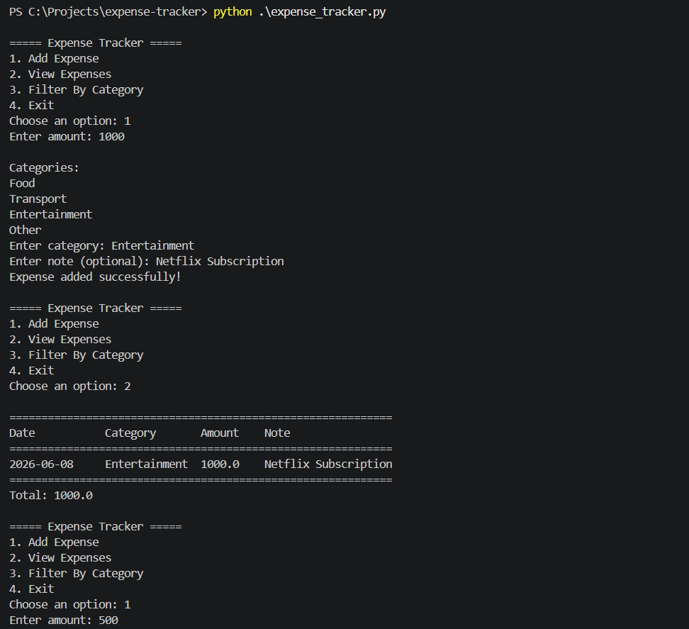
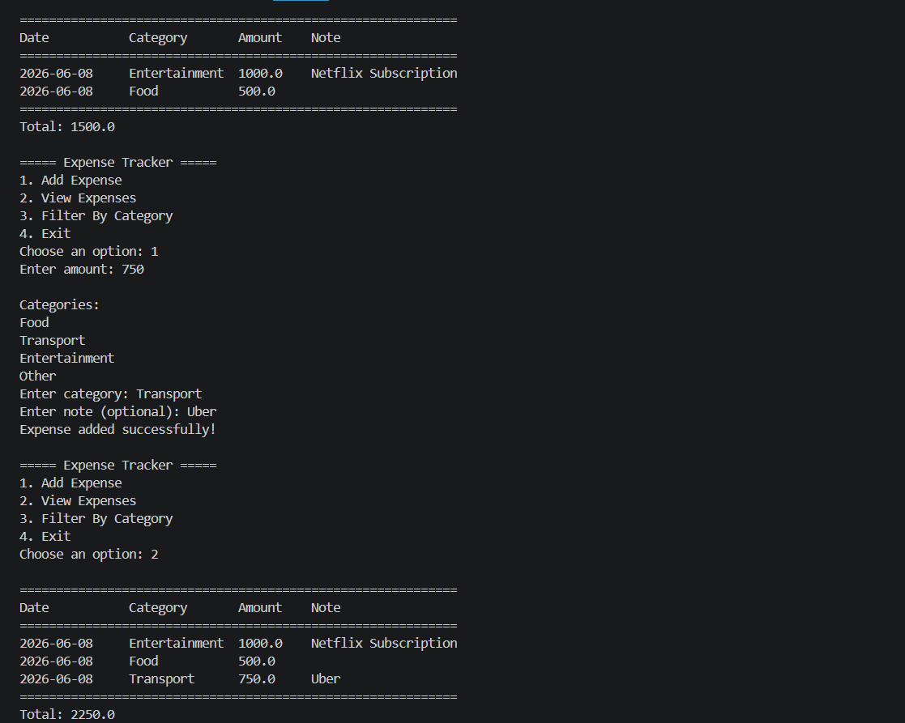

# Personal Expense Tracker

## Description

A command-line expense tracker built using Python.

## Features

- Add expenses
- View all expenses
- Filter expenses by category
- Data persists between runs using JSON storage

## How to run

```bash
python expense_tracker.py
```

## Screenshots

